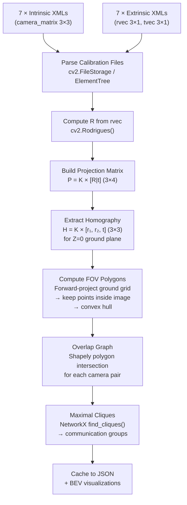

# Phase 0: Offline Setup — Technical Document

## Overview

Phase 0 is a **one-time computation** that builds the geometric infrastructure needed for cross-camera tracking. It answers two fundamental questions:
1. **"Where in the real world is this pixel?"** — Projection from image space to the ground plane
2. **"Which cameras see the same area?"** — FOV overlap graph and communication clusters

This phase runs once before any video processing and produces a cached data structure used by all subsequent pipeline phases.

**Script**: `scripts/pipeline/09_calibration.py`
**Output**: [calibration_cache.json](file:///Users/tahaoguzhanucar/Desktop/CV_term_project/output/calibration_cache.json)

---

## Pipeline Flow



---

## The Calibration Data

### Camera Mapping
| Our ID | File Prefix | Camera Name |
|:---:|:---:|:---|
| C1 | CVLab1 | Camera 1 |
| C2 | CVLab2 | Camera 2 |
| C3 | CVLab3 | Camera 3 |
| C4 | CVLab4 | Camera 4 |
| C5 | IDIAP1 | Camera 5 |
| C6 | IDIAP2 | Camera 6 |
| C7 | IDIAP3 | Camera 7 |

### Intrinsic Parameters (What's inside each camera)

Each camera has a **3×3 camera matrix K** encoding the camera's internal optics:

```
K = | fx   0   cx |
    |  0   fy  cy |
    |  0    0   1 |
```

- **fx, fy** = focal lengths in pixels (how "zoomed in" the camera is)
- **cx, cy** = principal point (where the optical axis hits the sensor)

| Camera | fx | fy | cx | cy |
|:---:|:---:|:---:|:---:|:---:|
| C1 | 1743.45 | 1735.16 | 934.52 | 444.40 |
| C2 | 1707.27 | 1719.04 | 978.13 | 417.02 |
| C3 | 1738.71 | 1752.89 | 906.57 | 462.03 |
| C4 | 1725.28 | 1720.58 | 995.01 | 520.42 |
| C5 | 1708.66 | 1737.19 | 936.09 | 465.18 |
| C6 | 1742.98 | 1746.01 | 1001.07 | 362.43 |
| C7 | 1732.47 | 1757.58 | 931.26 | 459.43 |

> [!NOTE]
> **Distortion coefficients are zeroed** in `intrinsic_zero/`. The images have already been undistorted by the WILDTRACK authors. We use these files, not `intrinsic_original/`.

### Extrinsic Parameters (Where each camera is in the world)

| Camera | rvec (Rodrigues) | tvec (cm) |
|:---:|:---|:---|
| C1 | [1.759, 0.467, -0.332] | [-526, 45, 987] |
| C2 | [0.617, -2.146, 1.658] | [1195, -337, 2041] |
| C3 | [0.551, 2.230, -1.772] | [55, -213, 1993] |
| C4 | [1.665, 0.967, -0.694] | [42, -45, 1107] |
| C5 | [1.213, -1.477, 1.278] | [837, 86, 600] |
| C6 | [1.691, -0.397, 0.355] | [-339, 63, 1044] |
| C7 | [1.644, 1.126, -0.727] | [-649, -57, 1053] |

### WILDTRACK Ground Plane

```python
origin = (-300, -90, 0)  # centimeters
size   = (3600, 1200)    # 36m × 12m outdoor courtyard
```

---

## Mathematical Foundation

### Step 1: Rodrigues → Rotation Matrix
```python
R, _ = cv2.Rodrigues(rvec)  # (3,3) — "which direction the camera faces"
```

### Step 2: Projection Matrix
```
P = K × [R | t]     →  3D world point [X,Y,Z] → 2D pixel [u,v]
```

### Step 3: Ground-Plane Homography (the key insight)

Since pedestrians walk on Z=0, the 3rd column of R drops out:

```
H = K × [r₁, r₂, t]     →  3×3 matrix (not 3×4)
```

This gives us bidirectional mapping:
- **H**: Ground (X,Y) → Pixel (u,v) — *"where does this floor point appear?"*
- **H⁻¹**: Pixel (u,v) → Ground (X,Y) — *"where on the floor is this pixel?"*

> [!IMPORTANT]
> **Why this matters**: When YOLO detects a person at pixel (800, 900), we take the bbox foot-point, apply H⁻¹, and get (X, Y) in centimeters. Now all 7 cameras speak the same coordinate system.

### Step 4: FOV Polygon Computation

> [!WARNING]
> **Bug found and fixed during implementation**: The naive approach (back-projecting image boundary pixels via H⁻¹) fails for steep-angle cameras. Pixels near the top of the image correspond to rays pointing at the horizon, which project to Z=0 at infinity.

**Solution adopted**: Forward-project a dense grid of ground points INTO each camera via H, keep only those landing inside the 1920×1080 image, take the convex hull. This is the same strategy used by the official WILDTRACK toolkit.

---

## Results

### FOV Areas

| Camera | FOV Area | Ground Bounds (cm) |
|:---:|:---:|:---|
| C1 | 143.4 m² | (-300, -90) → (950, 1110) |
| C2 | 367.5 m² | (-25, -90) → (3300, 1110) |
| C3 | 150.2 m² | (-300, -90) → (975, 1110) |
| C4 | 66.9 m² | (-300, -90) → (625, 1110) |
| C5 | 375.0 m² | (-125, -90) → (3300, 1110) |
| C6 | 278.4 m² | (-275, -90) → (2900, 1110) |
| C7 | 108.7 m² | (-300, 60) → (900, 1110) |

C2 and C5 see the most ground area (~368-375 m²). C4 has the narrowest view (67 m²).

### Bird's Eye View


### Pairwise Overlap Matrix


Key observations:
- **All 21 camera pairs overlap** (minimum 18.3% for C4↔C5)
- Highest overlaps: C1↔C3 (98.8%), C1↔C7 (98.7%), C3↔C7 (98.4%) — these 3 cameras see nearly identical ground area
- The weakest link C4↔C5 (18.3%) represents cameras on opposite sides of the courtyard

### Ablation Study


| Threshold | Edges | Cliques | Structure |
|:---:|:---:|:---:|:---|
| 1% – 15% | 21 | 1 | Single 7-camera clique (all connected) |
| 20% – 30% | 20 | 2 | Two 6-camera cliques (C4↔C5 edge drops) |

> [!TIP]
> **Ablation conclusion**: The graph is stable across all thresholds ≤15%. The only structural change occurs at 20% when the weakest pair (C4↔C5 = 18.3%) disconnects. **5% is confirmed as a safe default.**

### Implication for Cross-Camera Tracking

Since all 7 cameras form **one clique**, the Hungarian matching will compare all cameras against all cameras. This is:
- ✅ **Correct** — any person can potentially be seen by any camera
- ✅ **Computationally fine** — 7 cameras is a small graph (cost matrix is only 7×N)
- ✅ **Most accurate** — no identity missed due to a missing graph edge

### Validation (0.000 px error)

Both validation tests passed with **perfect precision**:
- **Round-trip**: pixel → world → pixel = 0.000000 px error (confirms H and H⁻¹ are exact inverses)
- **Cross-check**: H projection vs `cv2.projectPoints()` = 0.0000 px error (confirms our homography matches OpenCV's direct computation)

This is expected because the intrinsic files use zero distortion — the homography is an exact representation of the pinhole camera model with Z=0.
