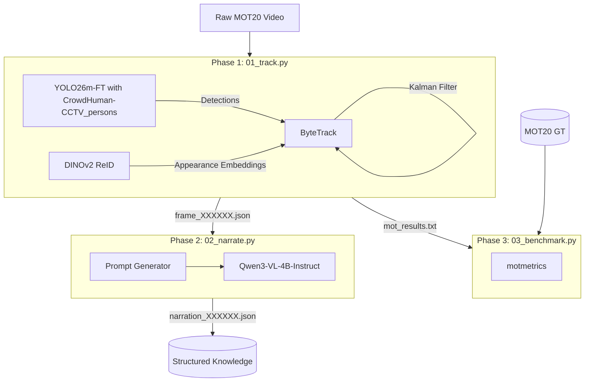

# Odin's Eye v3: MOT Pipeline Technical Documentation

This document provides an in-depth technical breakdown of the `mot/` directory in the Odin's Eye v3 project. It details the core logic, algorithms, and modules used to achieve dense pedestrian tracking and Vision-Language Model (VLM) narration.

## 1. System Architecture

The pipeline is structured into three discrete sequential phases:
1. **Phase 1: Pedestrian Tracking** - Extracting high-frequency bounding boxes and ReID embeddings from raw video frames.
2. **Phase 2: Scene Narration** - Generating structured semantic text regarding scene dynamics and individual behaviours using a Vision-Language Model.
3. **Phase 3: Benchmarking** - Evaluating tracking performance against ground-truth MOT annotations.

---

## 2. Core Concepts & Approaches

### 2.1. Object Detection (YOLO)
The pipeline relies on a high-capacity object detector (YOLOv11x or a fine-tuned YOLO26m) applied to every frame. Because crowds in the MOTChallenge dataset (like MOT20) are extremely dense resulting in severe mutual occlusions, standard detection struggles with false negatives (FN). This makes bounding box confidence scores highly variable.

### 2.2. ByteTrack Multi-Object Tracking
Traditional trackers discard low-confidence detections, leading to broken trajectories. The core logic of **ByteTrack** (`odin_eye_mot/tracker/bytetrack.py`) is a **two-pass data association** approach that allows the recovery of occluded tracks:

1. **Pass 1 (High-Conf Detections):** Matches standard high-confidence bounding boxes (>0.6) to all active or recently lost trajectories using Intersection over Union (IoU) and ReID cosine similarity.
2. **Pass 2 (Low-Conf Detections):** Matches remaining low-confidence boxes (0.1–0.6) strictly to "Tracked" trajectories that were left unmatched in Pass 1. *It does not spawn new tracks from low-confidence detections.*

**Motion Prediction:** A linear Kalman Filter (`kalman_filter.py`) predicts each track's center, width, and height (`cx, cy, w, h`) into the next frame to match the YOLO detections accurately.

### 2.3. DINOv2 Re-Identification (ReID)
DINOv2 (`odin_eye_mot/reid/dinov2_extractor.py`) acts as a secondary appearance signature. 
- Features (768-D for ViT-B) are extracted for each bounding box. 
- A track's feature embedding is updated using an Exponential Moving Average (EMA) to smooth changes in physical appearance (e.g. lighting changes, rotation).
- **Resurrection Logic (Step 7b):** If a person vanishes for a long time (>30 frames) but reappears within a 100-frame window (`reid_window`), and the track was previously "Removed", their visual similarity is tested against unmatched high-confidence detections to restore the original ID.

### 2.4. VLM Scene Narration (Qwen3-VL)
VLM interpretation acts as the novel layer of Odin's Eye v3. The `narrator.py` module uses Qwen3-VL via either Apple Silicon (`mlx-vlm`) or standard CUDA (`transformers`). 
It injects semantic reasoning iteratively into the tracking loops through different **Narration Modes**:
- `scene_summary`: Guesses density, counts groups, describes mass movement patterns.
- `person_describe`: Isolates a specific track ID (drawn distinctly on the frame) and extracts physical traits (clothing, accessories, posture).
- `interaction`: Discovers instances of crossing paths, walking together, etc.
- `anomaly`: Evaluates individuals breaking the broader flow.

---

## 3. Directory Breakdown & Script Execution

### `scripts/01_track.py`
**Purpose:** Iterates through MOT20 sequences frame-by-frame establishing baseline dense tracking.
**Core Logic:**
- Loads sequence using `MOT20Sequence`.
- For each frame: `detect()` → `tracker.update()` → JSON serialization.
- Visualizations are optional (`--visualize`). Tracks are saved to a directory as `frame_00000X.json` detailing ID, bbox coordinates, age, and hit counts.
- **Outputs:** An evaluation-friendly text file (`mot_results.txt`) adhering strictly to the MOTChallenge format.

### `scripts/02_narrate.py`
**Purpose:** Interprets the tracking histories produced in `01_track.py`.
**Core Logic:**
- Samples frames every $N$ interval (default 30 frames).
- Re-reads `frame_XXX.json` files and reconstructs lightweight mock `Track` instances.
- Forwards the actual pixel frame accompanied by rendered track identifiers (`T001`) into Qwen3-VL with a carefully formulated prompt layout indicating the required JSON response format.
- Output JSONs (`narration_summary.json`) contain high-level scene intelligence for downstream applications or user interfaces.

### `scripts/03_benchmark.py`
**Purpose:** Uses the standardized `motmetrics` Python library to calculate global sequence accuracy.
**Core Logic:**
- Uses the Hungarian Algorithm via `iou_matrix` matching between ground-truth and our model predictions (`mot_results.txt`).
- Calculates the following critical MOT factors:
  - **MOTA (Accuracy):** Strongly incorporates False Positives and Identity Switches.
  - **IDF1 (Identity F1 Score):** Validates camera stability; does our pipeline retain identical IDs over time despite occlusion?

---

## 4. `odin_eye_mot` Library Internals

- `tracker/bytetrack.py`: Handles state assignments (New, Tracked, Lost, Removed) and matrix tracking. Includes `linear_assignment` (SciPy fallback into custom greedy matching) and robust tracking structures inside the `Track` class.
- `tracker/kalman_filter.py`: State space modeling containing an $8 \times 8$ covariance matrix and specifically scaled process/measurement noise profiles fitted mathematically for walking pedestrians.
- `reid/dinov2_extractor.py`: Leverages PyTorch Hub to load Vision Transformer networks. Responsible for image resizing, tensor normalization, and masking.
- `vlm/narrator.py`: Implements backend abstraction (`_MLXBackend` vs `_TransformersBackend`) alongside rigorous templated prompt schemas wrapped elegantly in Python formatting structures (`textwrap.dedent`). Generates prompt-constrained JSON parsing ensuring structured responses.
